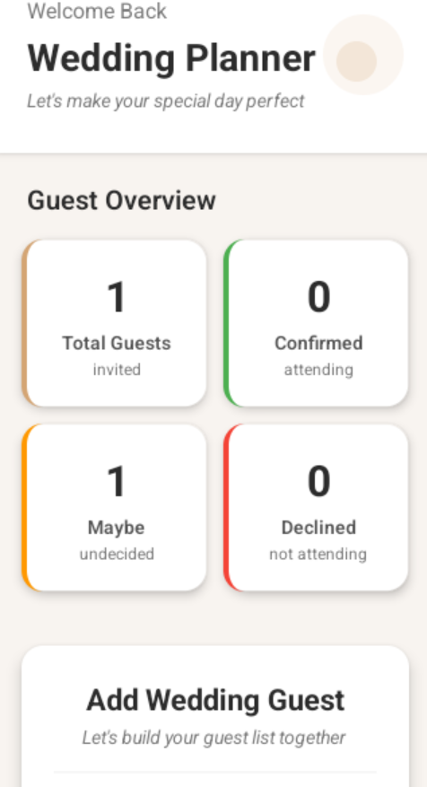
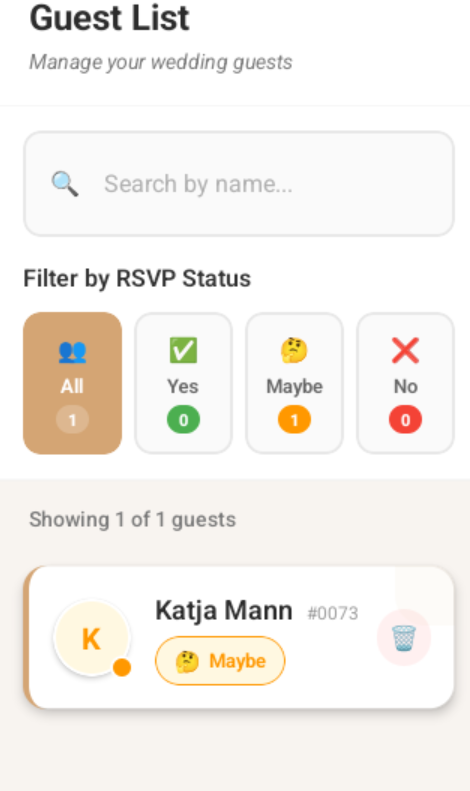

# Wedding Planner App 💍

A beautiful React Native application for managing wedding guests with both manual entry and random guest generation via API.

<div align="center">   </div>

## Download App
### Link https://drive.google.com/file/d/1KkWTCnYishlib0V2jnvunVs_Asl8ypVu/view?usp=sharing

## Features ✨

- **Add guests** with name and RSVP status (Yes/No/Maybe)
- **View all guests** in a beautiful list with visual indicators
- **Delete guests** with smooth animations
- **Random guest generation** using RandomUser API
- **Search functionality** to find guests quickly
- **Filter guests** by RSVP status
- **Data persistence** with AsyncStorage
- **Statistics display** showing total and confirmed guests

## Installation 📦

1. **Clone the repository**
   ```bash
   git clone https://github.com/samipevekar/wedding-planner-assignment
   cd wedding-planner-assignment
   ```

2. **Install dependencies**
   ```bash
   npm install
   ```

3. **Run app**
   ```bash
   npm run android
   ```
